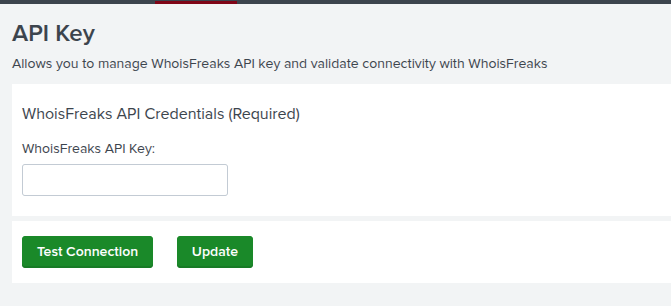

# WhoisFreaks App for Splunk and Splunk ES
## Quick Start Guide
### App Installation 
The latest app is available on Splunkbase. Please ensure the prerequisites are met. For Splunk Cloud deployments, install the app directly from Splunkbase. For on-prem distributed environments, deploy the WhoisFreaks App to both indexer and search head cluster members using the standard process for deploying apps and add-ons to clusters. See the App Installation section for more information.  
### Configure the Base Search
The base search is an SPL Query that allows users to define which log sources are to be monitored by the WhoisFreaks App. It should output the required fields the WhoisFreaks App uses to populate WHOIS and DNS dashboards. The app arrives with a pre-configured performance-optimized query. This query will work well in
environments where data sources are Common Information Model (CIM) compliant.  
To configure the base search, go to WF Settings→ Configure Log Source. The required fields are: url, src, dest, log_source, domain, and _time. See Configuring Base Search Using the Pre-Configured Query for more information.  
### Adding a WhoisFreaks API Key
Navigate to WF Settings → API Key to enter your WhoisFreaks API Key. WhoisFreaks API Key is available on WhoisFreaks billing dashboard. If this is your first time setting up Splunk with WhoisFreaks, please contact our [Enterprise Support](https://whoisfreaks.com/contact) to ensure your API key is appropriately provisioned.  
Saving new API credentials will prompt you to enable default saved searches. Please click the "Enable" button to enable the minimum set of saved searches that run the enrichment process.  
### Configure Enrichment
We recommend leaving the current settings as a default. If you wish to customize the Enrichment Settings:  
1. Go to WF Settings → Configure Enrichment.  
2. Once any of the following settings are changed, select the Save button.  

#### Select WHOIS / DNS fields to monitor
1. Go to WF Settings → Configure Enrichment. 
2. Select or deselect the fields you want to monitor from the WHOIS and DNS records of a specific domain. Only those fields will be shown on the WHOIS and DNS enrichment.  
#### Configure Cache and Queue Wait Time
 1. Go to WF Settings → Configure Enrichment. 
 2. Select the Queue Wait Time to configure it. Queue Wait Time is how often the app enriches Domain information. Default is 5 minutes. Decreasing the frequency can be helpful to reduce API usage or if the enrichment is taking longer than 5 minutes to run on a higher volume Splunk cluster. 
 3. Select Cache settings to configure it. WhoisFreaks maintains a cache to reduce API query usage. A user may wish to disable or reduce the cache retention period times when monitoring volatile domains. 
 4. **Enable Cache** - Enabled by default to optimize API consumption. Disable the cache to monitor for changes < 1 day old. (CAUTION: this can result in high API consumption)
 5. **Add the Cache Retention Period** - Sets how long domain enrichment should live in the cache before being re-queried. 30 days is the default.  

 ## Deployment Guide 
 ### Overview 
 The following sections outline some background architecture and deployment information that is helpful for new users to understand. Additional information covering the app components: configuration files, stanzas and fields,
KV store, macros, and saved searches is contained in [Appendix A](https://github.com/WhoisFreaks/splunk-docs/edit/main/README.md#appendix-a-app-components).   
The Saved Searches configuration file (`savedsearches.conf`) defines the processes for enrichment and the Queue Builder for the `wf_enrich_queue` KV store. In the Queue Builder process, raw logs in the Splunk Indexes are queried from the Web data model as defined by the DomainTools base search configuration (`wf_basesearch`). This process includes checking to see if the domain already exists when comparing to existing wf Enrich data, as
that would indicate if the domain has already been enriched. If not, the new domain is queued for enrichment. Each domain is stored with the enriched data in the KV store.  
### Prerequisites
The WhoisFreaks App works best with Splunk Enterprise Security (ES), which makes it easy for an analyst to set up alerts on specific newly registered domains or any specific registrant or hsoting IP, but can function as a standalone monitoring platform without Splunk ES. Customers who have not yet deployed ES can still realize significant value from the WhoisFreaks solution.  
The app works best when installed on indexers, in addition to previous requirements, during deployment. Our [Enterprise Support](https://whoisfreaks.com/contact) team can assist with workarounds if such a setup is not feasible for your environment.
### Firewall Rule
Ensure you can reach `https://api.whoisfreaks.com/` from the Splunk server. If required, update firewall rules to allow access to this endpoint for the app to be functional.  
If you are on a managed infrastructure and cannot connect to the WhoisFreaks endpoint, please reach out to us so we can help verify any additional IP allow-listing activities that may be needed. 
### Splunk Credentials to Install App
A Splunk account with admin access is required to successfully install and configure the app. After installation, most user functions should be available with less privileged accounts.  
You may also need command-line access (like SSH access) to perform some deployment and diagnostics functions, especially if deploying in a clustered environment.  
### Splunk Permissions to Operate App
Ensure that the `list_storage_passwords` privilege is added to the user operating the app. The admin role may need to be used to access the password storage within Splunk.  
Users within the WhoisFreaks App must have read privileges to all the components of the app. If a user expects to add, update, or append values in any of the internal stores, their user profiles must include write privileges to the KV stores involved. For the list of KV stores and descriptions, please see the [App Components](https://github.com/WhoisFreaks/splunk-docs/edit/main/README.md#appendix-a-app-components) Appendix.  
### Validating the App in Non-Production Environments
If you use a staging environment or development environment to test new Splunk apps, ensure the same data sources you plan to use in production are also available to the Splunk `search heads` in the test environment.  

## Application Setup  
This section covers the base items needed to get your WhoisFreaks App for Splunk instance up and running.  
### Configuring Base Search Using the Pre-Configured Query  
The app arrives with a pre-configured performance-optimized query. This query will work well in environments where data sources are Common Information Model (CIM) compliant.  
First, identify relevant CIM-compliant data sources for ingestion. It may be data sources already configured to use web proxy events, for example. If your base search involves working with relevant data sources that are not CIM-compliant.  
To use the pre-configured query:  
1. Go to WF Settings → Configure Log Source page
2. Confirm the details of the pre-configured Splunk search query. The pre-configured base search made available in the app is:
```
tstats summariesonly=true count FROM datamodel=Web BY _time Web.url Web.src Web.dest source | rename Web.url AS url |
 rename Web.src AS src | rename Web.dest AS dest | rename source AS log_source |
wfdomainextract field_in=url field_out=domain | eval domain=lower(domain) | fields url src dest log_source domain _time
```
The app natively supports logs with multivalue URLs contained in a single event entry, commonly seen in Proofpoint logs.  
3. If needed, customize the preconfigured base search to ensure the required fields are available  
4. Select the Save button.
5. Select the Timeframe for the Base Search.  

Base search requirements and recommendations:  
* `domain` and `_time` are required output fields to operate the app
* We recommend adding the optional fields Source, Destination, and Log Source in your base search. They provide additional contextual information on the events. The app will also not error out in the absence of these fields.

Performance considerations: 
* The Web data model must have acceleration turned on
* If acceleration is not turned on, yet data has been mapped to the CIM, you can modify the base search to use `summariesonly=false` with some potential degradation in performance.

If you already have the domains extracted out in the CIM, you can remove the `wfdomainextract` function fromyour base search. This will further improve performance.  

### Managing API Key
  
Adding and Testing API Connectivity:  
1. Navigate to WF Settings → API Key.
2. Enter your WhoisFreaks API Key
3. Click the Test Connection button to validate the connection(s).
4. Once validated, click Update to save the settings

### configure Saved Searches  
The app uses a series of Saved Searches to automate operational tasks within Splunk. The full list of saved searches can be found in the [Saved Search Names and Descriptions](https://github.com/WhoisFreaks/splunk-docs/edit/main/README.md#table-saved-search-names-and-descriptions) table in Appendix A.  
Upon clicking Test Connection after entering your API key above,you will be prompted to enable the default set of saved searches. Clicking enable will turn on the set of seven minimum required saved searches for the Core App functionality noted in the saved searches [table](https://github.com/WhoisFreaks/splunk-docs/edit/main/README.md#table-saved-search-names-and-descriptions).  

## Further Configurations
The above sections describe the minimum steps required to get started. The following sections go into additional detail to help configure the application to provide the most value in your environment.  
### Configuring the Base Search Using the Custom SPL
Configuring Base Search using your own custom Search Processing Language query (SPL) may be necessary if data is not yet CIM compliant, or input data sources are from ingested data from several different sources. 
First, identify relevant data sources for ingestion. It may contain URLs or hostnames, in addition to domain names. IP addresses are not supported for processing with this app.  
To configure using custom SPL:  
1. Craft the Splunk search query that efficiently finds events from your preferred data source(s).
   a. It is not necessary (or effective) to write regular expressions or other parsing rules to extract domains in logs filled with hostnames or URLs or de-duplicate logs. This task is handled by WhoisFreaks queue builder search jobs.
   b. We recommend using `tstats`. It is also used in the pre-configured base search for optimization.
2. Add the query as the base search via WF Settings → Configure Log Source page
3. Add the query in the Base Search input field.
4. Click the Save button

Your custom SPL must meet these criteria:
1. If your custom search does not begin `tstats` you must add search to ensure proper functionality once it is merged into the WhoisFreaks scheduled searches.
2. Must not start with a pipe | character
3. Ensure the result contains a field named domain or use `rename` function
4. The search must efficiently return results from the last 10 minutes of events. Ideally in a few seconds, but no longer than two or three minutes

### Enable Mass Enrichment
We recommend leaving the current settings as a default. If you wish to customize the Enrichment Settings:  
1. Go to WF Settings → Configure Enrichment
2. Once any of the following settings are changed, select the Save button.
   * Select the Queue Wait Time. Queue Wait Time is how often the app enriches Domain information. Default is 5 minutes. Decreasing the frequency can be helpful to reduce API usage or if the enrichment is taking longer than 5 minutes to run on a higher volume Splunk cluster
   * Configure the Cache Settings
     * WhoisFreaks maintains a cache to reduce API query usage. A user may wish to disable or reduce the cache retention period times when monitoring volatile domains.
     * Enable Cache - Enabled by default to optimize API consumption. Disable the cache to monitor for changes < 1 day old. (CAUTION: this can result in high API consumption)
     * Add the Cache Retention Period - Sets how long domain enrichment should live in the cache before being re-queried. 30 days is the default.
   * Select DNS & WHOIS fields you want to monitor and used for enrichment.

## Appendix A: App Components
The Splunk app is provisioned with the following main components.  
### Table: Main Configuration Files, Stanzas, and Fields
These configuration files are relevant to utilizing the app and WhoisFreaks datasets.  

 > Note 
 > The configuration files are relevant for this version only. The configuration files,stanzas and fields will be different in
other versions.

<table>
 <tr>
 <th> Conf File</th>
 <th>Stanza Tag</th>
 <th>Fields</th>
 <th>Description</th>
 </tr>
 <tr>
  <td rowspan="4">app.conf</td>
   <td>package</td>
   <td>id</td>
   <td rowspan="4">Add details for the Splunk App.</td>
  </tr>
  <tr>
   <td>install</td>
   <td>is_configured</td>
  </tr>
  <tr>
   <td>ui</td>
   <td>is_visible, label</td>
  </tr>
  <tr>
    <td>launcher</td>
   <td>author, description, version</td>
  </tr>

  <tr>
  <td rowspan="5">commands.conf</td>
   <td>wfapiusage</td>
   <td>chunked,filename</td>
   <td rowspan="5">These are helper commands for the app. The most commonly used ones outside the app are described in greater detail in Extending WhoisFreaks Commands Outside the App, as well as the in-app
documentation.<br>
<b>chunked</b> is used to indicate the search command supports Splnuk’s “chunked” custom protocol, used by all of these stanzas.  <br>
<b>filename</b> Indicates the location of the Python .py filenames for thesecommands.</td>
  </tr>
  <tr>
   <td>wfdomainextract</td>
   <td>chunked,filename</td>
  </tr>
  <tr>
   <td>wfwhois</td>
   <td>chunked,filename</td>
  </tr>
  <tr>
    <td>wfdns</td>
   <td>chunked,filename</td>
  </tr>
  <tr>
    <td>wfexpirecache</td>
   <td>chunked,filename</td>
  </tr>

   <tr>
   <td rowspan="5">searchbnf.conf</td>
    <td>wfapiusage-command</td>
   <td>syntax, shortdesc, usage, comment1, example1</td>
   <td rowspan="5">The syntax (shorter name), description and if the usage is public.</td>
  </tr>
  <tr>
   <td>wfdomainextract-command</td>
   <td>syntax, shortdesc, usage, comment1, example1</td>
  </tr>
  <tr>
   <td>wfwhois-command</td>
   <td>syntax, shortdesc, usage, comment1, example1</td>
  </tr>
  <tr>
    <td>wfdns-command</td>
   <td>syntax, shortdesc, usage, comment1, example1</td>
  </tr>
   <tr>
    <td>wfexpirecache-command</td>
   <td>syntax, shortdesc, usage, comment1, example1</td>
  </tr>

   <tr>
   <td>server.conf</td>
    <td>shclustering</td>
   <td>conf_replication_include.WhoisFreaks</td>
   <td>Default value is set to true.</td>
  </tr>

   <tr>
  <td rowspan="4">transforms.conf</td>
   <td>wf_stats</td>
   <td>external_type, collection, fields_list, case_sensitive_match</td>
   <td rowspan="4">These are KV store fields. Please see the table in this section KV Store/Collection Name with Descriptions and Fieldsfor the array of <b>fields_list</b> for each stanza.</td>
  </tr>
  <tr>
   <td>wf_enrich_queue</td>
   <td>external_type, collection,
fields_list,
case_sensitive_match</td>
  </tr>
  <tr>
   <td>wf_whois_data</td>
   <td>external_type, collection,
fields_list,
case_sensitive_match</td>
  </tr>
  <tr>
    <td>wf_dns_data</td>
   <td>external_type, collection,
fields_list,
case_sensitive_match</td>
  </tr>

   <tr>
  <td rowspan="3">whoisfreaks.conf</td>
   <td rowspan="3">whoisfreaks</td>
   <td>bulk_lookup_batch_size</td>
   <td>Number of domains batched in an API
call. Set the value from 1 to 100. Default is 100.</td>
  </tr>
  <tr>
   <td>optimize_lookup</td>
   <td>This enables quicker correlation of cached data of known domains from lookup table. This feature requires additional disk-space, so disabling this will reduce disk space consumption but slow down the searches. Default is enabled.</td>
  </tr>
  <tr>
   <td>logging_on</td>
   <td>Toggles whether or not to write logs to
file.</td>
  </tr>

  <tr>
  <td rowspan="3">distsearch.conf</td>
   <td rowspan="3">replicationWhitelist</td>
   <td>domainextract</td>
   <td>Path to domainextract custom search
command to be copied to indexers</td>
  </tr>
   <tr>
   <td>lib</td>
   <td>Path to python libs to be copied to
indexers.</td>
  </tr>
 
</table>

### Table: KV Store/ Collection Names and Fields
<table>
 <tr>
  <th>KV Store / Collection Name</th>
  <th>Fields</th>
 </tr>
 <tr>
  <td>wf_stats</td>
  <td>_key, domain_name,whois_status,dns_status,first_seen,last_seen</td>
 </tr>
 <tr>
  <td>wf_enrich_queue</td>
  <td>_key, domain,queued,observed</td>
 </tr>
  <tr>
  <td>wf_whois_data</td>
  <td>_key, wf_queued,wf_retrieved,wf_observed,_raw,domain_name,status,query_time,create_date,update_date,expiry_date,<br>domain_registrar_id,domain_registrar_name,domain_registrar_whois,domain_registrar_url,registrant_name,registrant_company,registrant_address,<br>registrant_city,registrant_state,registrant_zip,registrant_country_code,registrant_country,registrant_email,registrant_phone,<br>registrant_fax,administrative_name,administrative_company,administrative_address,administrative_city,<br>administrative_state,administrative_zip,administrative_country_code,administrative_country,<br>administrative_email,administrative_phone,administrative_fax,technical_name,technical_company,technical_address,technical_city,<br>technical_state,technical_zip,technical_country_code,technical_country,technical_email,technical_phone,technical_fax,billing_name,billing_company<br>,billing_address,billing_city,billing_state,billing_zip,billing_country_code,billing_country,billing_email,<br>billing_phone,billing_fax,name_server_1,name_server_2,name_server_3,<br>name_server_4,domain_status_1,domain_status_2,domain_status_3,domain_status_4,reseller_name,reseller_email,reseller_phone</td>
 </tr>
  <tr>
  <td>wf_dns_data</td>
  <td>_key, dwf_queued,wf_retrieved,wf_observed,_raw,domain_name,status,,<br>a_records,aaaa_records,mx_records,spf_records,ns_records,txt_records,cname_records,soa_records</td>
 </tr>
</table>

### Table: Key Macros for Enrichment
<table>
 <tr>
  <th>Macro Field Name</th>
  <th>Default Value</th>
  <th>Description</th>
 </tr>
 <tr>
  <td>wf_basesearch</td>
  <td></td>
  <td>The value that is defined is the base search. Data is pulled
directly from the <b>datamodel</b>. We use this search to search for
and queue up domains for the app and certain features such as
the dashboards</td>
 </tr>
  <tr>
  <td>wf_rename_base_fields</td>
  <td></td>
  <td>Rename base fields of Url, src, dest, domain, and log_source from base search log file.</td>
 </tr>
  <tr>
  <td>enable_cache</td>
  <td>1 (enbaled)</td>
  <td>Enrichment setting to determine caching of enriched data.
WhoisFreaks will always enrich every domain in the queue.
When turned off (set to 0) an API call will be made for every
domain.</td>
 </tr>
  <tr>
  <td>wf_cache_retention_period</td>
  <td>30 (days)</td>
  <td>Enrichment setting. Set the value to how many days back before
removing older data from the enrichment kvstore.
There is also a saved search that will remove records that are
over 30 days old.</td>
 </tr>
  <tr>
  <td>wf_enrich_to_stats_lookup</td>
  <td></td>
  <td>A partial search that is used by the saved searches that update
the enriched data KV Store.</td>
 </tr>
  <tr>
  <td>wf_whois_fields</td>
  <td></td>
  <td>WHOIS fields store in enriched data KV store.</td>
 </tr>
  <tr>
  <td>wf_dns_fields</td>
  <td></td>
  <td>DNS fields store in enriched data KV store.</td>
 </tr>
</table>

### Table: Saved Search Names and Descriptions
<table>
 <tr>
  <th>Saved Search Name</th>
  <th>Type</th>
  <th>Description ofthe Saved Search </th>
  <th>Required</th>
  <th>App Functionalities</th>
 </tr>
 <tr>
  <td>WhoisFreaks - Queue Builder to Enrich KV Store</td>
  <td>Reports</td>
  <td>A search to extract domains from raw events based on your configured base search and store them in the <b>wf_enrich_queue</b> KV store for enrichment.</td>
  <td>Yes</td>
  <td>Core App</td>
 </tr>
 <tr>
  <td>WhoisFreaks - Whois Enrichment</td>
  <td>Reports</td>
  <td>A search to enrich domains found in <b>wf_enrich_queue</b>, and store results in <b>wf_whois_data collection</b>. By default, the search is scheduled to run every 5 minutes and pulls data over the past 30 minutes. You can customize this frequency in the app.</td>
  <td>Yes</td>
  <td>Core App</td>
 </tr>
 <tr>
  <td>WhoisFreaks - DNS Enrichment</td>
  <td>Reports</td>
  <td>A search to enrich domains found in <b>wf_enrich_queue</b>, and store results in <b>wf_dns_data collection</b>. By default, the search is scheduled to run every 5 minutes and pulls data over the past 30 minutes.</td>
  <td>Yes</td>
  <td>Core App</td>
 </tr>
  <tr>
  <td>WhoisFreaks - Expire Old Queue Data</td>
  <td>Reports</td>
  <td>A search to remove domains from the <b>wf_enrich_queue</b> collection that are over a day old.</td>
  <td>Yes</td>
  <td>Core App</td>
 </tr>
  <tr>
  <td>WhoisFreaks - Expire Old Whois Data</td>
  <td>Reports</td>
  <td>A search to remove enrichment data from the <b>wf_whois_data</b> collection based on the cache retention settings configured in the app.</td>
  <td>Yes</td>
  <td>Core App</td>
 </tr>
  <tr>
  <td>WWhoisFreaks - Expire Old DNS Data</td>
  <td>Reports</td>
  <td>A search to remove enrichment data from the <b>wf_dns_data</b> collection based on the cache retention settings configured in the app.</td>
  <td>Yes</td>
  <td>Core App</td>
 </tr>
</table>


